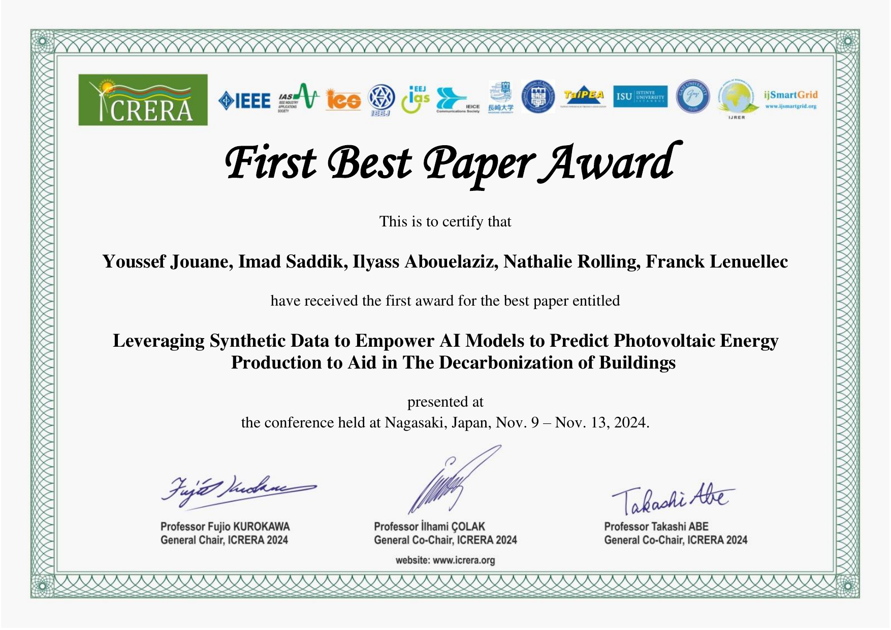

# Imad Saddik

Software engineer and astronomer based in Morocco 🇲🇦

[Email](mailto:simad3647@gmail.com) / [Medium](https://medium.com/@imadsaddik) / [LinkedIn](https://www.linkedin.com/in/imadsaddik/) / [GitHub](https://github.com/ImadSaddik) / [HuggingFace](https://huggingface.co/ImadSaddik)

## 👩🏼‍💻 Engineering Experience

**Frontend Engineer** @ [BRYTER](https://bryter.com/) _(Dec 2020 - Present)_  
No-code platform that enables professionals to build interactive applications.
  - Founding member of BRYTER's design system team and continued to provide support and extend the component library
  - Wrote code in multiple architecture layers, including the application core and integrations with external services
  - Implemented a new Vue 3 app using Vite to replace a legacy Vue 2 and Webpack architecture
  - **_Technologies used:_** Vue, TypeScript, Jest, Testing Library, HTML, CSS, Sass, Vite, Web Components (LitElement).
  

**Google Season of Docs 2020 | Technical Writer** @ [GraphQL Foundation](https://foundation.graphql.org/) _(Aug 2020 - Jan 2021)_  
[Google Season of Docs](https://developers.google.com/season-of-docs/docs/participants) is a program matching experienced technical writers with open source organizations.
  - Created a [Frequently Asked Questions (FAQ) resource](https://graphql.org/faq/) for graphql.org, including all the content and page functionality
  - Triaged issues and reviewed pull requests to the [GraphQL website](https://github.com/graphql/graphql.github.io/)
  - Wrote [internal documentation](https://github.com/graphql/graphql.github.io/blob/source/CONTRIBUTING.md) to improve the contributing experience
  - **_Technologies used:_** CSS, React, TypeScript, Gatsby, GraphQL.
  

**Software Engineer** @ [Meeshkan](http://meeshkan.com/) _(Oct 2019 - Sep 2020)_  
Early-stage startup focused on automated API testing and NLP.
  - Built the [website](https://meeshkan.com/) and the initial web app that visualized the test reports
  - Maintained [unmock-js](https://github.com/meeshkan/unmock-js), an open-source fuzz testing library
  - Ownership of Meeshkan's documentation and technical blog
  - **_Technologies used:_** TypeScript, React, Gatsby, Chakra, Next.js, Node.js, GraphQL, REST, Jest, CircleCI, Python.
  - **_Selected open-source work:_**
    - [Jest configuration for the unmock-js runner](https://github.com/meeshkan/unmock-jest-runner)
    - [Property-based testing for JavaScript developers](https://dev.to/meeshkan/property-based-testing-for-javascript-developers-21b2)
    - [HTTP Mocking Toolkit documentation](https://github.com/meeshkan/hmt)
      

**Frontend Engineer** @ [Blacklane](https://www.blacklane.com/en) _(Mar 2018 - Sep 2019)_  
Professional chauffeur service available in over 300 cities worldwide.
  - Worked in a cross-functional, agile team to rebuild and rebrand the [B2C booking experience](https://www.blacklane.com/en/)
  - Led an accessibility initiative resulting in the website [passing WCAG 2.0 requirements](https://www.blacklane.com/en/accessibility/)
  - Extended and maintained a company-wide design system
  - **_Technologies used:_** HTML, CSS, JavaScript ES6, React, TypeScript, Storybook, Redux, Next.js, REST, Jest, Mocha, Cypress, TravisCI.
    

**Technical Writer** @ [Contentful](https://www.contentful.com/) _(Sep 2017 - Feb 2018)_  
API-first infrastructure to create, manage and distribute content.
  - Ownership of Contentful's [technical blog](https://www.contentful.com/blog/)
  - Wrote [developer experience documentation](https://www.contentful.com/developers/docs/)
  - Assistance with information architecture and UX writing for the web app
  - **_Technologies used:_** React, Gatsby, Node.js, GraphQL, REST, Contentful.
  - **_Selected writing:_**
    - [JavaScript SDK guide](https://www.contentful.com/developers/docs/javascript/tutorials/using-js-cda-sdk/)
    - [Node.js example app and courses](https://the-example-app-nodejs.contentful.com/courses)
    - Concept references: [Domain model](https://www.contentful.com/developers/docs/concepts/domain-model/), [Multiple environments](https://www.contentful.com/developers/docs/concepts/multiple-environments/)
      
    
## Accomplishments

- **First Best Paper Award** @ [ICRERA 2024 — 13th International Conference on Renewable Energy Research and Applications](https://www.icrera.org/archieve2024/)
  _Awarded in November 2024_
  
  [Read the paper on IEEE Xplore](https://ieeexplore.ieee.org/document/10815288)
  

- **Built [My Universe Hub](https://myuniversehub.com/)** – A personal website reimagining NASA’s APOD with a modern and interactive UI using **Vue.js** and **Django**.

- **Created a course on training LLMs from scratch** on FreeCodeCamp
  Covers the full lifecycle of LLMs: data encoding, tokenizers, pretraining, and fine-tuning.
  [Watch the course](https://www.youtube.com/watch?v=9Ge0sMm65jo&t)

- **Created a course on Elasticsearch** on FreeCodeCamp
  Teaches core concepts, indexing, querying, and practical integrations.
  [Watch the course](https://www.youtube.com/watch?v=a4HBKEda_F8)

- **Created an OSRM (Open Source Routing Machine) course** on 3CodeCamp
  Intro to OSRM architecture, routing basics, and building navigation apps.
  [Watch the course](https://www.youtube.com/watch?v=Ke_NISW-bDM&list=PLMSb3cZXtIfoT7duU9eAdpmcnDq2rINUJ&index=1&t)

## Education

**Master’s Degree in Industrial Engineering – AI & Data Science**
[ENSAM Meknès – École Nationale Supérieure d'Arts et Métiers](http://www.ensam-umi.ac.ma/)
_2021 – 2024_

**Associate Degree in Electrical Engineering**
[ESTM Meknès – École Supérieure de Technologie de Meknès](https://www.est.umi.ac.ma/)
_2019 – 2021_

**Baccalaureate in Electrical Science and Technology**
[Lycée Moulay Ismail, Meknès](https://www.google.com/maps/place/School+Moulay+Ismail/@33.9041744,-5.5457042,17z/data=!3m1!4b1!4m6!3m5!1s0xda044dc9b13b681:0xd09762d0a901ebd1!8m2!3d33.9041744!4d-5.5457042!16s%2Fg%2F1tfryv64?entry=ttu&g_ep=EgoyMDI1MDUyOC4wIKXMDSoASAFQAw%3D%3D)
_2016 – 2019_

## Languages

🇲🇦 **Arabic** - Native  
🇺🇸 **English**  
🇫🇷 **French**
